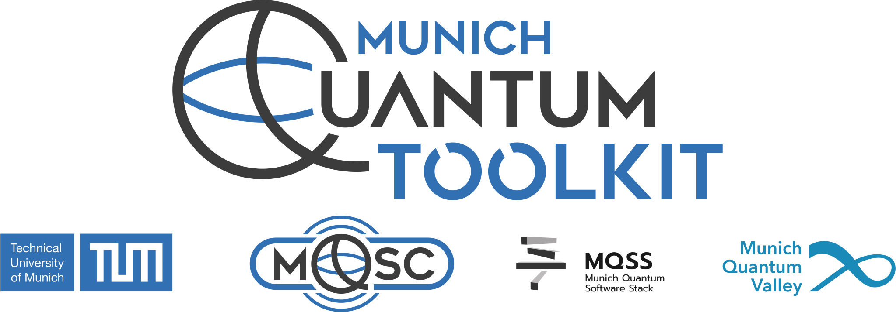
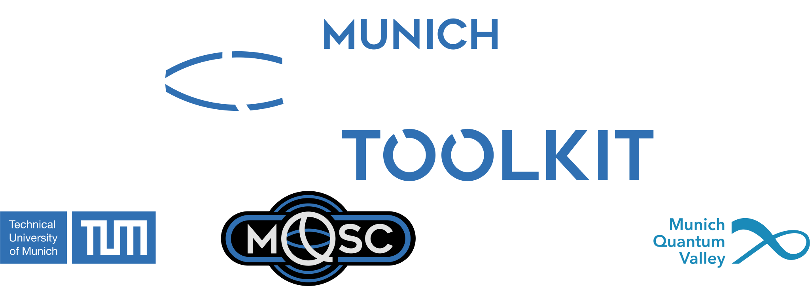

# Logos & Branding

The MQT provides a set of official logos for use in presentations, publications, websites, and other materials.
All logos are available in **light** and **dark** variants and in both **SVG** (vector, infinitely scalable) and **PNG** (high-resolution raster) formats.

:::{tip}
The {fa}`fa-solid fa-sun` **Light** / {fa}`fa-solid fa-moon` **Dark** tabs are **synchronised** across all cards — switching one switches them all.
The checkered background in each preview area indicates a transparent logo background.
:::

---

::::::::{grid} 1 1 2 2
:gutter: 3

<!-- ── MQT Logo ─────────────────────────────────────────── -->

:::::::{grid-item-card}
:class-header: sd-py-2 sd-font-weight-bold

{fa}`fa-solid fa-image` MQT Logo
^^^

::::::{tab-set}
:sync-group: mqt-logo-variant

:::::{tab-item} {fa}`fa-solid fa-sun` Light
:sync: light

```{raw} html
<div class="mqt-preview mqt-preview--light">
  
</div>
<div class="mqt-btn-row">
  <a href="_static/logo-mqt-light.svg" download="logo-mqt-light.svg"
     class="sd-sphinx-override sd-btn sd-btn-sm sd-btn-outline-primary" role="button">
    <i class="fa-solid fa-download"></i>&thinsp;SVG
  </a>
  <a href="_static/logo-mqt-light.png" download="logo-mqt-light.png"
     class="sd-sphinx-override sd-btn sd-btn-sm sd-btn-outline-primary" role="button">
    <i class="fa-solid fa-download"></i>&thinsp;PNG
  </a>
</div>
```

:::::

:::::{tab-item} {fa}`fa-solid fa-moon` Dark
:sync: dark

```{raw} html
<div class="mqt-preview mqt-preview--dark">
  
</div>
<div class="mqt-btn-row">
  <a href="_static/logo-mqt-dark.svg" download="logo-mqt-dark.svg"
     class="sd-sphinx-override sd-btn sd-btn-sm sd-btn-outline-primary" role="button">
    <i class="fa-solid fa-download"></i>&thinsp;SVG
  </a>
  <a href="_static/logo-mqt-dark.png" download="logo-mqt-dark.png"
     class="sd-sphinx-override sd-btn sd-btn-sm sd-btn-outline-primary" role="button">
    <i class="fa-solid fa-download"></i>&thinsp;PNG
  </a>
</div>
```

:::::

::::::

:::::::

<!-- ── MQSC Logo ───────────────────────────────────────── -->

:::::::{grid-item-card}
:class-header: sd-py-2 sd-font-weight-bold

{fa}`fa-solid fa-image` MQSC Logo
^^^

::::::{tab-set}
:sync-group: mqt-logo-variant

:::::{tab-item} {fa}`fa-solid fa-sun` Light
:sync: light

```{raw} html
<div class="mqt-preview mqt-preview--light">
  
</div>
<div class="mqt-btn-row">
  <a href="_static/logo-mqsc-light.svg" download="logo-mqsc-light.svg"
     class="sd-sphinx-override sd-btn sd-btn-sm sd-btn-outline-primary" role="button">
    <i class="fa-solid fa-download"></i>&thinsp;SVG
  </a>
  <a href="_static/logo-mqsc-light.png" download="logo-mqsc-light.png"
     class="sd-sphinx-override sd-btn sd-btn-sm sd-btn-outline-primary" role="button">
    <i class="fa-solid fa-download"></i>&thinsp;PNG
  </a>
</div>
```

:::::

:::::{tab-item} {fa}`fa-solid fa-moon` Dark
:sync: dark

```{raw} html
<div class="mqt-preview mqt-preview--dark">
  
</div>
<div class="mqt-btn-row">
  <a href="_static/logo-mqsc-dark.svg" download="logo-mqsc-dark.svg"
     class="sd-sphinx-override sd-btn sd-btn-sm sd-btn-outline-primary" role="button">
    <i class="fa-solid fa-download"></i>&thinsp;SVG
  </a>
  <a href="_static/logo-mqsc-dark.png" download="logo-mqsc-dark.png"
     class="sd-sphinx-override sd-btn sd-btn-sm sd-btn-outline-primary" role="button">
    <i class="fa-solid fa-download"></i>&thinsp;PNG
  </a>
</div>
```

:::::

::::::

:::::::

<!-- ── Q Mark ──────────────────────────────────────────── -->

:::::::{grid-item-card}
:class-header: sd-py-2 sd-font-weight-bold

{fa}`fa-solid fa-image` Q Mark
^^^

::::::{tab-set}
:sync-group: mqt-logo-variant

:::::{tab-item} {fa}`fa-solid fa-sun` Light
:sync: light

```{raw} html
<div class="mqt-preview mqt-preview--light">
  
</div>
<div class="mqt-btn-row">
  <a href="_static/logo-q-light.svg" download="logo-q-light.svg"
     class="sd-sphinx-override sd-btn sd-btn-sm sd-btn-outline-primary" role="button">
    <i class="fa-solid fa-download"></i>&thinsp;SVG
  </a>
  <a href="_static/logo-q-light.png" download="logo-q-light.png"
     class="sd-sphinx-override sd-btn sd-btn-sm sd-btn-outline-primary" role="button">
    <i class="fa-solid fa-download"></i>&thinsp;PNG
  </a>
</div>
```

:::::

:::::{tab-item} {fa}`fa-solid fa-moon` Dark
:sync: dark

```{raw} html
<div class="mqt-preview mqt-preview--dark">
  
</div>
<div class="mqt-btn-row">
  <a href="_static/logo-q-dark.svg" download="logo-q-dark.svg"
     class="sd-sphinx-override sd-btn sd-btn-sm sd-btn-outline-primary" role="button">
    <i class="fa-solid fa-download"></i>&thinsp;SVG
  </a>
  <a href="_static/logo-q-dark.png" download="logo-q-dark.png"
     class="sd-sphinx-override sd-btn sd-btn-sm sd-btn-outline-primary" role="button">
    <i class="fa-solid fa-download"></i>&thinsp;PNG
  </a>
</div>
```

:::::

::::::

:::::::

<!-- ── MQSS Logo ───────────────────────────────────────── -->

:::::::{grid-item-card}
:class-header: sd-py-2 sd-font-weight-bold

{fa}`fa-solid fa-image` MQSS Logo
^^^

::::::{tab-set}
:sync-group: mqt-logo-variant

:::::{tab-item} {fa}`fa-solid fa-sun` Light
:sync: light

```{raw} html
<div class="mqt-preview mqt-preview--light">
  
</div>
<div class="mqt-btn-row">
  <a href="_static/logo-mqss-light.svg" download="logo-mqss-light.svg"
     class="sd-sphinx-override sd-btn sd-btn-sm sd-btn-outline-primary" role="button">
    <i class="fa-solid fa-download"></i>&thinsp;SVG
  </a>
  <a href="_static/logo-mqss-light.png" download="logo-mqss-light.png"
     class="sd-sphinx-override sd-btn sd-btn-sm sd-btn-outline-primary" role="button">
    <i class="fa-solid fa-download"></i>&thinsp;PNG
  </a>
</div>
```

:::::

:::::{tab-item} {fa}`fa-solid fa-moon` Dark
:sync: dark

```{raw} html
<div class="mqt-preview mqt-preview--dark">
  
</div>
<div class="mqt-btn-row">
  <a href="_static/logo-mqss-dark.svg" download="logo-mqss-dark.svg"
     class="sd-sphinx-override sd-btn sd-btn-sm sd-btn-outline-primary" role="button">
    <i class="fa-solid fa-download"></i>&thinsp;SVG
  </a>
  <a href="_static/logo-mqss-dark.png" download="logo-mqss-dark.png"
     class="sd-sphinx-override sd-btn sd-btn-sm sd-btn-outline-primary" role="button">
    <i class="fa-solid fa-download"></i>&thinsp;PNG
  </a>
</div>
```

:::::

::::::

:::::::

<!-- ── TUM-CDA Logo────────────────────────────────────── -->

:::::::{grid-item-card}
:class-header: sd-py-2 sd-font-weight-bold

{fa}`fa-solid fa-image` TUM-CDA Logo
^^^

::::::{tab-set}
:sync-group: mqt-logo-variant

:::::{tab-item} {fa}`fa-solid fa-sun` Light
:sync: light

```{raw} html
<div class="mqt-preview mqt-preview--light">
  
</div>
<div class="mqt-btn-row">
  <a href="_static/logo-tum-cda-light.svg" download="logo-tum-cda-light.svg"
     class="sd-sphinx-override sd-btn sd-btn-sm sd-btn-outline-primary" role="button">
    <i class="fa-solid fa-download"></i>&thinsp;SVG
  </a>
  <a href="_static/logo-tum-cda-light.png" download="logo-tum-cda-light.png"
     class="sd-sphinx-override sd-btn sd-btn-sm sd-btn-outline-primary" role="button">
    <i class="fa-solid fa-download"></i>&thinsp;PNG
  </a>
</div>
```

:::::

:::::{tab-item} {fa}`fa-solid fa-moon` Dark
:sync: dark

```{raw} html
<div class="mqt-preview mqt-preview--dark">
  
</div>
<div class="mqt-btn-row">
  <a href="_static/logo-tum-cda-dark.svg" download="logo-tum-cda-dark.svg"
     class="sd-sphinx-override sd-btn sd-btn-sm sd-btn-outline-primary" role="button">
    <i class="fa-solid fa-download"></i>&thinsp;SVG
  </a>
  <a href="_static/logo-tum-cda-dark.png" download="logo-tum-cda-dark.png"
     class="sd-sphinx-override sd-btn sd-btn-sm sd-btn-outline-primary" role="button">
    <i class="fa-solid fa-download"></i>&thinsp;PNG
  </a>
</div>
```

:::::

::::::

:::::::

<!-- ── MQT Banner ─────────────────────────────────────── -->

:::::::{grid-item-card}
:class-header: sd-py-2 sd-font-weight-bold
:columns: 12

{fa}`fa-solid fa-panorama` MQT Banner
^^^

::::::{tab-set}
:sync-group: mqt-logo-variant

:::::{tab-item} {fa}`fa-solid fa-sun` Light
:sync: light

```{raw} html
<div class="mqt-preview mqt-preview--light mqt-preview--banner">
  
</div>
<div class="mqt-btn-row">
  <a href="_static/mqt-banner-light.svg" download="mqt-banner-light.svg"
     class="sd-sphinx-override sd-btn sd-btn-sm sd-btn-outline-primary" role="button">
    <i class="fa-solid fa-download"></i>&thinsp;SVG
  </a>
  <a href="_static/mqt-banner-light.png" download="mqt-banner-light.png"
     class="sd-sphinx-override sd-btn sd-btn-sm sd-btn-outline-primary" role="button">
    <i class="fa-solid fa-download"></i>&thinsp;PNG
  </a>
</div>
```

:::::

:::::{tab-item} {fa}`fa-solid fa-moon` Dark
:sync: dark

```{raw} html
<div class="mqt-preview mqt-preview--dark mqt-preview--banner">
  
</div>
<div class="mqt-btn-row">
  <a href="_static/mqt-banner-dark.svg" download="mqt-banner-dark.svg"
     class="sd-sphinx-override sd-btn sd-btn-sm sd-btn-outline-primary" role="button">
    <i class="fa-solid fa-download"></i>&thinsp;SVG
  </a>
  <a href="_static/mqt-banner-dark.png" download="mqt-banner-dark.png"
     class="sd-sphinx-override sd-btn sd-btn-sm sd-btn-outline-primary" role="button">
    <i class="fa-solid fa-download"></i>&thinsp;PNG
  </a>
</div>
```

:::::

::::::

:::::::
